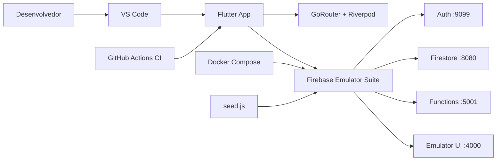

# Arquitetura Atual do CodeQuest

## Visão Geral

O projeto está estruturado para desenvolvimento mobile com Flutter e backend serverless no Firebase, priorizando separação por camadas, manutenção e escalabilidade incremental.

## Stack Base

- Flutter + Dart (frontend mobile)
- Firebase Auth, Firestore, Functions, Messaging, Storage
- Riverpod 2.x para estado e DI
- Hive para persistência local
- Docker Compose para emuladores locais
- GitHub Actions para CI

## Estrutura de Pastas

```text
codequest/
  firebase/
    functions/
    seed/
    firebase.json
    firestore.rules
    firestore.indexes.json
  lib/
    core/
      firebase_config.dart
      router.dart
      theme.dart
    features/
      <feature>/
        data/
        domain/
        providers/
        presentation/
    shared/
      theme/
      widgets/
  docs/
  .vscode/
  .github/workflows/
```

## Core Técnico

- Inicialização centralizada em main.dart com Firebase, Hive e ProviderScope.
- Navegação centralizada com GoRouter em core/router.dart.
- Tema visual centralizado em core/theme.dart e shared/theme/app_colors.dart.
- Infra local em docker-compose com emuladores e seed de dados.
- Estratégia de ambiente documentada em docs/ENVIRONMENT.md para local (Docker) e produção.

## Diagrama de Infraestrutura



## Princípios Arquiteturais

- Clean Architecture por feature.
- DDD tático leve: domínio explícito em entidades/VOs/casos de uso.
- Dependência sempre apontando para dentro (presentation -> application/domain -> data).
- Repositórios abstraindo serviços externos.

## Convenções de Código

- Comentários e documentação em português.
- Sem lógica de negócio em widgets.
- Providers como fronteira de composição entre UI e casos de uso.
- Cada nova feature deve seguir a mesma topologia de pastas.

## Fluxo de Desenvolvimento

1. Subir infraestrutura local com make up ou make infra-up.
2. Gerar código com build_runner.
3. Implementar por feature seguindo data/domain/providers/presentation.
4. Rodar analyze e test antes de abrir PR.

## Checklist para Novas Features

- Criou pasta da feature com camadas completas.
- Definiu contratos de repositório no domínio/aplicação.
- Implementou adapter em data.
- Expos providers mínimos para UI.
- Adicionou testes de caso de uso e repositório.
