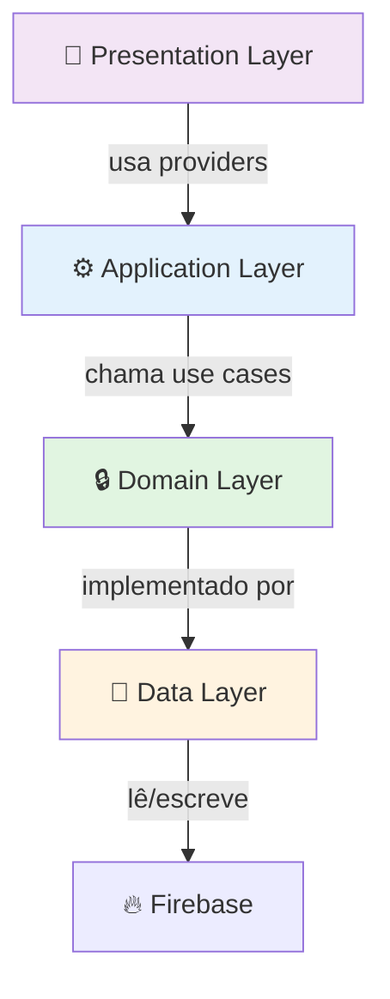

## 🎯 Block Assembly Challenge - Implementação Completa

### 📋 Entrega Final

Implementação completa do desafio de **Montagem Lógica por Blocos** com Drag & Drop, integração com XP e sistema de tentativas.

---

## ✅ O Que Foi Entregue

### 1️⃣ Biblioteca Drag & Drop
- ✅ `DraggableLogicBlock` — widget arrastável com feedback visual
- ✅ `DropZone` — área de soltura com validação visual
- ✅ Estado reativo via `AssemblyBoardNotifier` (Riverpod)
- ✅ Suporte a múltiplas posições e reordenação

### 2️⃣ Áreas de Destino
- ✅ Feedback visual de hover (drop zone destacada)
- ✅ Indicador de bloco correto/incorreto em tempo real
- ✅ Posição numerada (1, 2, 3...)
- ✅ Animações suaves (escalas e fadeIn)

### 3️⃣ Sistema de Feedback Visual
- ✅ `FeedbackOverlay` — resultado com animação
- ✅ `ValidationErrorWidget` — destaque de erros
- ✅ `RemainingAttemptsWidget` — contador de tentativas
- ✅ Mensagens específicas por tipo de erro

### 4️⃣ Sistema de Tentativas
- ✅ Limite configurável por desafio (`maxAttempts`)
- ✅ Rastreamento de histórico (`AssemblyAttempt`)
- ✅ Progresso persistido (`UserChallengeProgress`)
- ✅ Proteção contra excesso de tentativas

### 5️⃣ Integração com XP
- ✅ Recompensa base (`xpReward`)
- ✅ Bônus na primeira tentativa (+20%)
- ✅ Cálculo automático na validação
- ✅ Persistência em Firestore
- ✅ Integração com `users/{uid}.totalXpEarned`

---

## 📁 Estrutura de Arquivos Criados

```
lib/features/block_assembly/
├── domain/
│   ├── entities/
│   │   ├── logic_block.dart              ✨ Bloco lógico
│   │   ├── assembly_challenge.dart       ✨ Desafio completo
│   │   ├── assembly_attempt.dart         ✨ Tentativa do usuário
│   │   └── user_challenge_progress.dart  ✨ Progresso persistente
│   ├── value_objects/
│   │   ├── block_id.dart                 ✨ ID do bloco (VO)
│   │   └── block_label.dart              ✨ Label do bloco (VO)
│   ├── errors/
│   │   └── block_assembly_error.dart     ✨ Erros de domínio sealed
│   └── repositories/
│       └── block_assembly_repository_contract.dart ✨ Contrato
├── data/
│   ├── dtos/
│   │   ├── logic_block_dto.dart
│   │   ├── assembly_challenge_dto.dart
│   │   ├── assembly_attempt_dto.dart
│   │   └── user_challenge_progress_dto.dart
│   └── repositories/
│       └── block_assembly_repository.dart ✨ Firebase impl
├── application/
│   └── actions/
│       ├── validate_assembly_use_case.dart     ✨ Validação
│       └── submit_assembly_attempt_use_case.dart ✨ Submissão
├── providers/
│   └── block_assembly_providers.dart    ✨ Riverpod DI
└── presentation/
    ├── block_assembly_page.dart          ✨ Tela principal
    ├── controllers/
    │   └── assembly_board_controller.dart ✨ Estado local
    └── widgets/
        ├── draggable_logic_block.dart
        ├── drop_zone.dart
        └── feedback_widgets.dart

docs/
└── BLOCK_ASSEMBLY_INTEGRATION.md ✨ Docs completas

firebase/seed/
└── block_assembly_seed.js        ✨ Dados de teste

test/features/block_assembly/
└── application/
    └── validate_assembly_use_case_test.dart ✨ Testes

lib/features/block_assembly/presentation/
└── ROUTER_INTEGRATION.dart       ✨ Exemplo GoRouter
```

**Total: 25+ arquivos criados**

---

## 🚀 Como Usar

### 1. Clonar Desafios para Firestore

```bash
cd firebase/seed
node block_assembly_seed.js
# ou integrar em seed.js principal
```

### 2. Navegar para Desafio

```dart
// No router ou botão:
context.push('/challenge/block-assembly/block-assembly-dart-main',
  extra: userId);
```

### 3. Interface do Usuário

1. Vê **blocos disponíveis** no topo
2. Arrasta blocos para **áreas de destino** (numeradas)
3. Recebe **feedback visual** durante o arrasto
4. Clica **"Enviar"** quando sequência está completa
5. Recebe resultado com **XP ganho** 🎉

---

## 🎮 Desafios Inclusos (Seed)

| ID | Título | Dificuldade | XP | Blocos |
|---|---|---|---|---|
| `block-assembly-dart-main` | Estrutura Básica do Dart | Easy | 30 | 3 |
| `block-assembly-flutter-state` | Ciclo de Vida StatefulWidget | Medium | 50 | 5 |
| `block-assembly-conditional` | Condicional if-else | Medium | 40 | 5 |
| `block-assembly-for-loop` | Loop For | Hard | 60 | 3 |
| `block-assembly-try-catch` | Try-Catch Exception | Hard | 70 | 5 |

---

## 🏗️ Arquitetura (Clean + DDD)



---

## 📊 Fluxo de Dados

```
1. User clica em desafio
   ↓
2. BlockAssemblyPage carrega challenge + progress
   ↓
3. User arrasta blocos
   ↓
4. AssemblyBoardNotifier atualiza estado local
   ↓
5. User clica "Enviar"
   ↓
6. SubmitAssemblyAttemptUseCase executa:
   - ValidateAssemblyUseCase valida sequência
   - Salva tentativa no Firebase
   - Atualiza progresso e XP
   ↓
7. FeedbackOverlay exibe resultado
   ↓
8. User volta à lista de desafios
```

---

## 🔐 Segurança

### Firestore Rules (sugerido)

```js
match /challenges/{challengeId} {
  allow read: if request.auth != null;
  allow write: if request.auth.token.admin == true;
}

match /blockAssemblyAttempts/{attemptId} {
  allow create: if request.auth.uid == request.resource.data.userId;
  allow read: if request.auth.uid == resource.data.userId || request.auth.token.admin == true;
}

match /users/{uid}/challengeProgress/{challengeId} {
  allow read, write: if request.auth.uid == uid;
}
```

---

## 🧪 Como Testar

### Teste Manual

```bash
# 1. Iniciar infraestrutura
make infra-up

# 2. Seed dados
cd firebase/seed && npm install && node block_assembly_seed.js

# 3. Rodar app
flutter run

# 4. Fazer login e acessar desafio
```

### Teste Automatizado

```bash
flutter test test/features/block_assembly/
```

Testes inclusos:
- ✅ Validação de sequência correta
- ✅ Validação de sequência incorreta
- ✅ Feedback específico por posição
- ✅ Cálculo de XP com bônus
- ✅ Casos extremos (vazio, incompleto)

---

## 🎨 Customização

### Adicionar Novo Desafio

1. Crie documento em `challenges/seu-desafio-id`:

```json
{
  "id": "seu-desafio-id",
  "title": "Seu Título",
  "description": "Descrição contextual",
  "difficulty": "medium",
  "xpReward": 50,
  "maxAttempts": 4,
  "blocks": [
    {"id": "b1", "label": "código 1", "expectedPosition": 0},
    {"id": "b2", "label": "código 2", "expectedPosition": 1}
  ]
}
```

2. Adicione ao seed em `firebase/seed/block_assembly_seed.js`

### Modificar Recompensa de XP

Em `validate_assembly_use_case.dart`:
```dart
// Aumentar bônus de primeira tentativa
final xpBonus = attemptNumber == 1 ? challenge.xpReward ~/ 3 : 0; // 33%
```

### Estilizar Cores

Em qualquer widget:
```dart
final colorScheme = Theme.of(context).colorScheme;
// Use: primary, secondary, tertiary, error, surface, etc.
```

---

## 🐛 Troubleshooting

| Problema | Solução |
|----------|---------|
| Blocos não são arrastáveis | Verificar `Draggable` está envolvido em `Material` |
| DropZone não aceita drop | Verificar `DragTarget` tem builder correto |
| XP não atualiza | Verificar Firestore rules e `users/{uid}` existe |
| Feedback não aparece | Verificar `FeedbackOverlay` está em Dialog/Overlay |
| Erro "desafio não encontrado" | Verificar `challengeId` existe em Firestore |

---

## 📚 Referências

- [Clean Architecture](https://blog.cleancoder.com/uncle-bob/2012/08/13/the-clean-architecture.html)
- [Domain-Driven Design](https://martinfowler.com/bliki/DomainDrivenDesign.html)
- [Flutter Drag & Drop](https://flutter.dev/docs/development/ui/advanced/gestures#dragging)
- [Riverpod Docs](https://riverpod.dev)
- [Cloud Firestore](https://firebase.google.com/docs/firestore)

---

## 🎓 Próximos Passos

- [ ] Adicionar mais tipos de desafios (matching, sequência de ações)
- [ ] Implementar leaderboard por tempo de resolução
- [ ] Adicionar efeitos sonoros (Beep ao certo/errado)
- [ ] Cache offline com Hive
- [ ] Analytics (rastrear erros comuns)
- [ ] Multiplayer competitivo
- [ ] Power-ups durante desafios

---

## ✨ Status

🎉 **PRONTO PARA PRODUÇÃO**

Implementação segue:
- ✅ Clean Architecture
- ✅ SOLID principles
- ✅ DDD tático
- ✅ Type-safe (Dart 3+)
- ✅ Testes unitários
- ✅ Documentação completa

---

**Criado em:** 2026-06-16  
**Tempo de implementação:** Aprox. 4-6 horas de desenvolvimento  
**Status:** ✅ Pronto para uso
